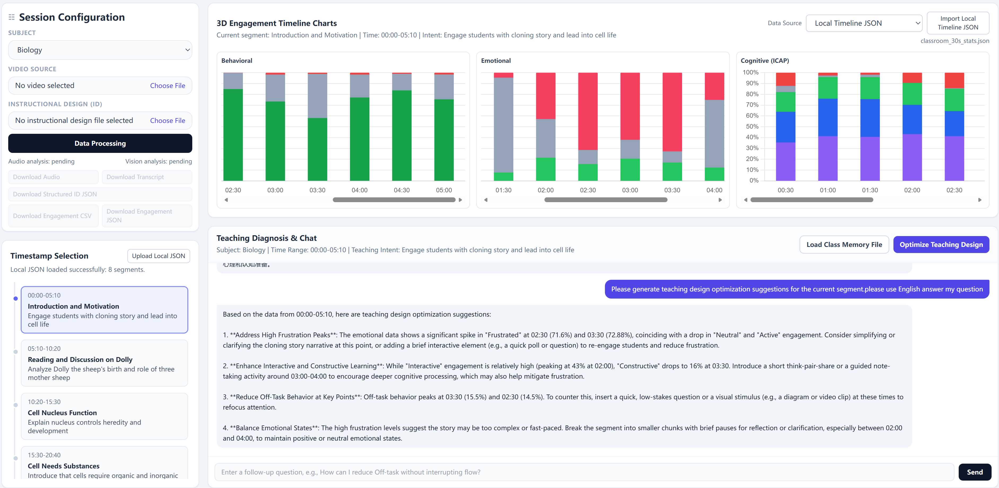

# MIDO-Chat

English | [中文](./README.md)

MIDO-Chat (Multimodal Instructional Design Optimization) is a classroom-focused multimodal teaching optimization workspace.  
It combines video detection (behavior/emotion), audio transcription + ICAP, instructional-design structuring, and LLM chat in one interface.

## Features

- One-click `Data Processing` pipeline: video upload, detection, audio transcription, ICAP, and structured instructional design
- 3D timeline charts: Behavioral / Emotional / Cognitive (ICAP) at 30-second granularity
- Data source switching: Video Analysis Results / Local Timeline JSON / Mock Data
- Teaching diagnosis and chat: streaming SSE output based on selected segment + intent + metrics
- Class memory file: load local baseline memory to generate class-specific suggestions
- Downloadable artifacts: audio, transcript, engagement CSV/JSON, structured instructional design JSON

## Project Showcase



> Place your screenshot at `docs/images/mido-chat-overview.png`.  
> For multiple screenshots, add more images under `docs/images/` and append markdown image links in this README.

## Tech Stack

- Backend: Python, FastAPI, Pydantic, OpenAI SDK, Jinja2, Uvicorn
- Frontend: HTML, Vanilla JavaScript, Tailwind CSS, Chart.js
- Media tools: FFmpeg (audio extraction/chunking)
- Vision: RT-DETR-DHSA (invoked from in-repo subdirectory)

## Project Structure

```text
MIDO-Chat/
├─ main.py
├─ llm_config.py
├─ llm.private.example.json
├─ llm.private.json          # local secret config (ignored)
├─ prompt_templates.py
├─ requirements.txt
├─ routers/
│  ├─ id_parser.py
│  ├─ metrics.py
│  ├─ optimize.py
│  └─ video.py
├─ templates/
│  └─ index.html
├─ generated/                # runtime outputs (ignored)
└─ RT-DETR-DHSA/
```

## Quick Start

### 1) Install dependencies

```bash
pip install -r requirements.txt
```

### 2) Configure model keys

Copy the example and fill your own keys:

```bash
cp llm.private.example.json llm.private.json
```

`llm.private.json` is already ignored by `.gitignore`.

### 3) Install FFmpeg (required)

Make sure these commands are available:

```bash
ffmpeg -version
ffprobe -version
```

### 4) Run

```bash
uvicorn main:app --reload
```

Open:

- [http://127.0.0.1:8000](http://127.0.0.1:8000)

## Core APIs

### Video processing and progress

- `GET /api/video/limits`
- `POST /api/video/upload/init`
- `POST /api/video/upload/chunk`
- `POST /api/video/upload/complete`
- `POST /api/video/extract_audio`
- `POST /api/video/transcribe_audio`
- `GET /api/video/transcribe_progress/{upload_id}`
- `GET /api/video/vision_progress/{upload_id}`

### Download endpoints

- `GET /api/video/audio/download/{audio_filename}`
- `GET /api/video/transcript/download/{transcript_filename}`
- `GET /api/video/vision_metrics/download/{upload_id}/csv`
- `GET /api/video/vision_metrics/download/{upload_id}/json`
- `GET /api/parse_id/download/{json_filename}`

### Instructional design and optimization

- `POST /api/parse_id`
- `POST /api/metrics_timeline/video`
- `POST /api/optimize` (SSE streaming)

## Class Baseline Memory File

The UI supports **Load Class Memory File**.  
Recommended format is JSON. Template file:

- `generated/class_memory_template.json`

This memory is passed into `/api/optimize` to produce more class-specific outputs.

## Prompt Templates

All prompts are centralized in:

- `prompt_templates.py`

Main keys:

- `id_parse_system` / `id_parse_user`
- `optimize_system` / `optimize_user`
- `chat_system` / `chat_user`
- `icap_window_system` / `icap_window_user`

## Security and Ignore Rules

Ignored by default:

- `llm.private.json`
- `generated/`
- `__pycache__/`
- test-case folder patterns (`*测试*/`, `*案例*/`, `test_cases/`, etc.)

## FAQ

- **Why do optimization responses look like fallback/mock?**  
  Check model-key configuration. The system falls back when no valid key is available.

- **Why does video processing fail or stall?**  
  Check FFmpeg availability, GPU/model paths, and upload completeness first.

- **Why are some segment buttons disabled (gray)?**  
  The current data source has no matching window data for that time range.

## License

No open-source license is currently included. Add a `LICENSE` file if needed.
